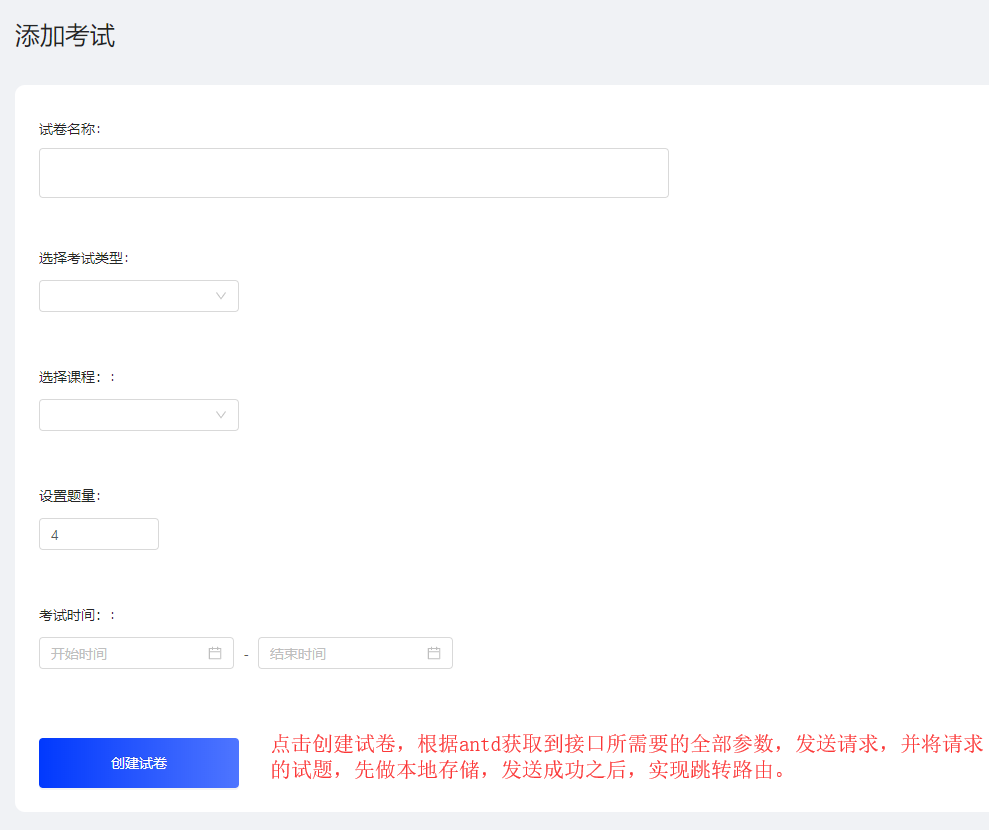
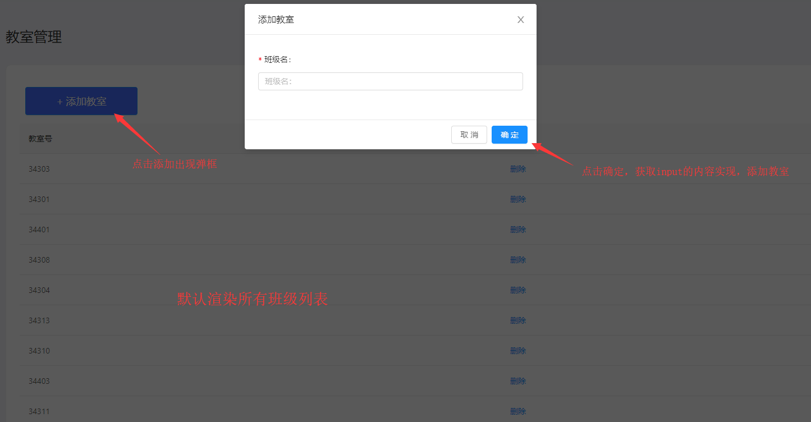

# exam-system
>考试系统管理  项目是基于 dva+Hooks+Axios+Redux-saga+React-router

## EasyMarket Screenshots

|       考试系统管理     |       添加试题     |       试题分类     |       查看试题     |
| :------------------: | :------------------: | :------------------: | :------------------: |
|  |  |  |  |

|       添加用户     |       用户展示     |
| :------------------: | :------------------: |
|  |  |

|       添加考试     |       试卷列表     |
| :------------------: | :------------------: |
|  |  |

|       班级管理     |       教室管理     |       学生管理     |
| :------------------: | :------------------: | :------------------: |
|  |  |  |

|       待批班级     |
| :------------------: |
|  |

## 部署
> 1. git clone git@github.com:zhangxin0723/exam-system.git
> 2. 安装依赖 cnpm install / npm install
> 3. 修改 utils 文件中 service 字段的值 = (http://169.254.12.198:7001/)
> 4. npm start

## Complicated Description

> 1.根据考试的内容添加考试的题目,在添加考试的时候可以多个选择考试内容要求,根据不同的班级分发不同的考试内容,
> 2.登录之后会在cookies面存储一个Token值 时限为2个小时
> 3.根据分发试卷的时间到时间会自动提交,管理人员看见班级的人员试卷进行批卷
考试系统管理
应用技术 dva框架+redux.saga+Hooks

<figure>
    
    
    
    
    
    
    
    
    
</figure>
